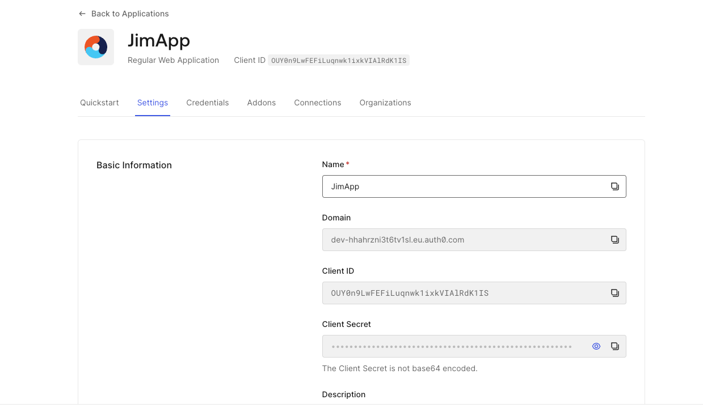
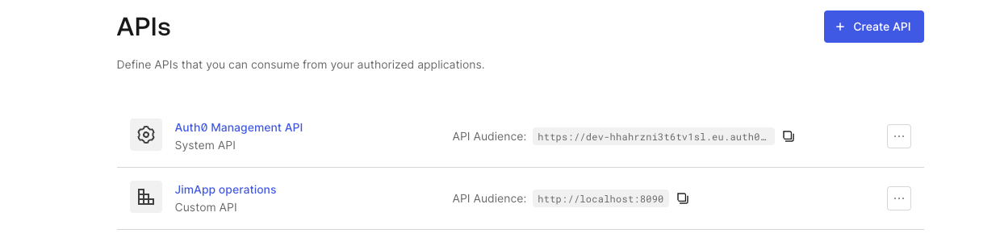
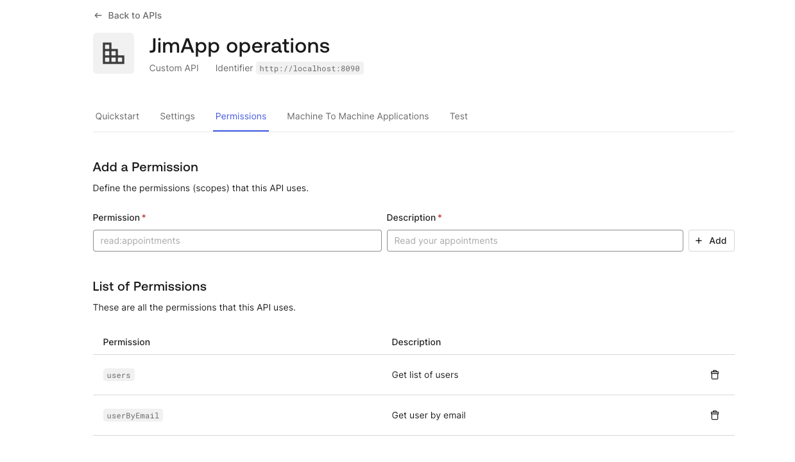
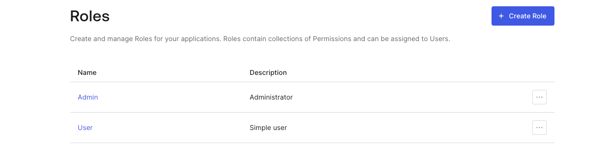
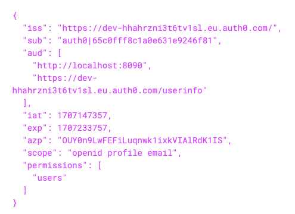

# Auth0 service

Code copied from: https://github.com/eugenp/tutorials/tree/master/spring-security-modules/spring-security-auth0  
See guide: https://www.baeldung.com/spring-security-auth0

# Auth0 tutorials

Auth0 User Management API: https://auth0.com/docs/api/management/v2/users/get-users  
Token revocation: https://auth0.com/docs/secure/tokens/revoke-tokens  
Get access token: https://auth0.com/docs/secure/tokens/access-tokens/get-access-tokens  
Get refresh token: https://auth0.com/docs/secure/tokens/refresh-tokens/get-refresh-tokens
MFA: https://auth0.com/docs/secure/multi-factor-authentication/multi-factor-authentication-factors

Note that grant type "client_credentials" does not return refresh token.

# Auth0 configuration

1. Create a web application as your client

2. Create an API

In our case we need a single API to secure all our operations. The API's identifier should be the service url.

3. Create permissions associated with this API.  

4. Create roles and assign them to users. Each role should be assigned one or more of the previously defined permissions.

5. Enable MFA (optionally)

Go to Multi-factor Authentication, enable "One-time Password" and change "Require Multi-factor Auth" to "Always".

# Resources (Operations)

| Operation    | Required Authority | Available in role |
|--------------|--------------------|-------------------|
| /users       | users              | User              |
| /userByEmail | userByEmail        | User, Admin       |
| /createUser  | -                  |                   |

Roles are configured in Auth0.

# Postman collection

[Auth Server PoC.postman_collection.json](Auth Server PoC.postman_collection.json)

# Usage

- Fill your client details in `application.properties`.
- Open in browser http://localhost:8090. You will be redirected to Auth0 login page.
- For testing purposes, `AuthController` logs the token received by Auth0. You can use this in Postman calls.

# Sample decoded JWT

